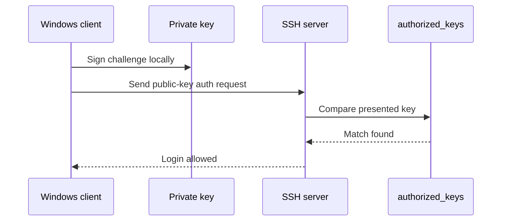
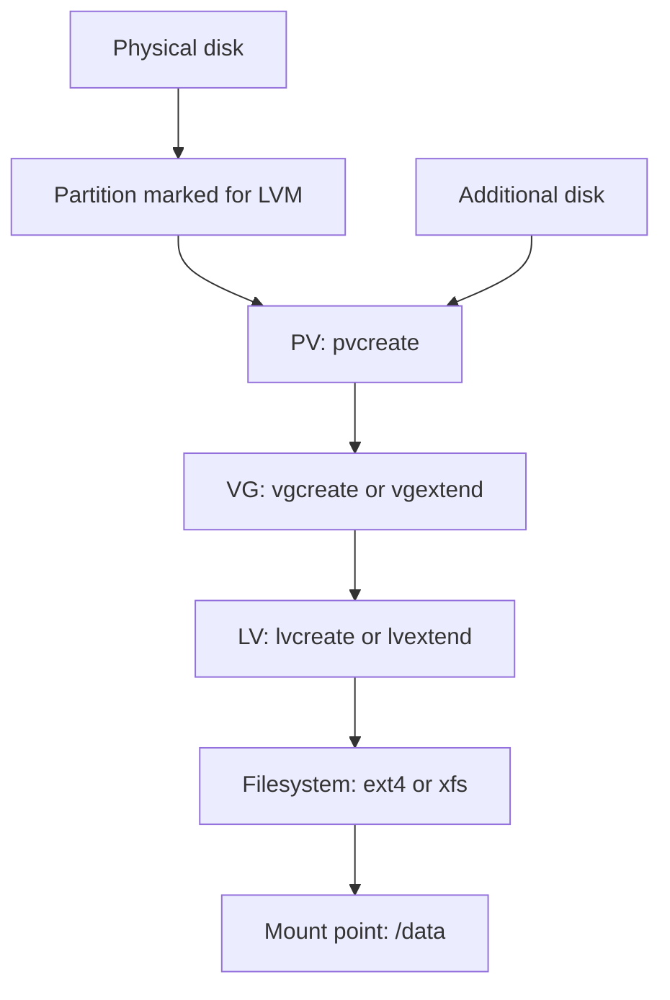
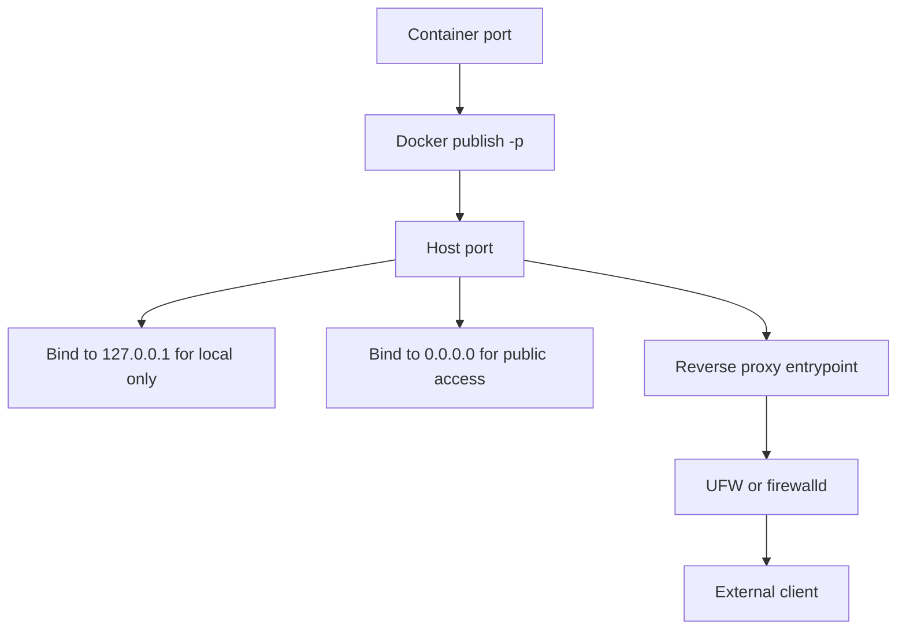
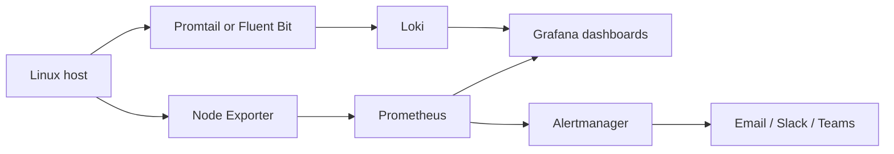
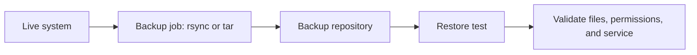

This syllabus starts with a 2-hour core (four 30-minute modules) and then extends into a full-day 12-hour Linux admin track. It balances fundamental concepts, hands-on practice, and essential networking/security skills like SSH.

------------------------------
## 🐧 Linux Essentials: 2-Hour Crash Course

### ⏱️ Course Overview

* Module 1 (0:00 - 0:30): Shell Navigation & The Help System
* Module 2 (0:30 - 1:00): File Manipulations & Text Processing
* Module 3 (1:00 - 1:30): Remote Access (SSH), File Transfer & Networking
* Module 4 (1:30 - 2:00): Permissions, Process Management & Troubleshooting

------------------------------
## 🛠️ Module 1: Shell Navigation & The Help System (30 Mins)

### Introduction to the CLI (5 mins)

* Linux relies on the Command Line Interface (CLI) for speed and server automation.
* The "Shell" (usually Bash or Zsh) translates your typed text into system actions.

### Basic Navigation (15 mins)

* pwd: Print Working Directory. Shows your exact current location.
* ls: List directory contents.
* ls -l: Long format (shows sizes, owners, and permissions).
   * ls -a: Shows hidden files (files starting with a dot, like .bashrc).
* cd: Change directory.
* cd /: Go to the root system directory.
   * cd ~ or just cd: Go to your user's home directory.
   * cd ..: Move up one level.
* Pro-Tip: Use the Tab key for autocomplete to prevent typos.

### Self-Help & Documentation (10 mins)

* man <command>: Opens the system manual (e.g., man ls). Press q to exit.
* <command> --help: Outputs a quick-reference summary flag list directly in the terminal.

------------------------------
## 📂 Module 2: File Manipulations & Text Processing (30 Mins)

### Creating and Moving Files (15 mins)

* mkdir <dir_name>: Create a new directory.
* touch <file_name>: Create an empty file or update an existing file's timestamp.
* cp <source> <destination>: Copy files.
* Use cp -r to copy folders recursively.
* mv <source> <destination>: Move or rename files and folders.
* rm <file>: Delete files.
* Use rm -rf <dir> to forcefully delete a directory and everything inside it (use with caution).

### Inspecting and Searching Text (15 mins)

* cat <file>: Dumps the entire file contents onto your screen.
* less <file>: Opens an interactive viewer for large files. Use arrow keys to scroll, q to quit.
* head -n 20 <file>: View the first 20 lines of a file.
* tail -n 20 <file>: View the last 20 lines of a file.
* tail -f <file>: Follow mode. Streams new additions to a file (like active log files) in real-time.
* grep "<search_term>" <file>: Searches for matching text patterns inside files.

------------------------------
## 🌐 Module 3: Remote Access (SSH), File Transfer & Networking (30 Mins)

### Introduction to SSH (10 mins)

* Secure Shell (SSH) encrypts the connection between your machine and a remote Linux server.
* Basic connection: ssh username@remote_host_ip
* Using a specific port: ssh -p 2222 username@remote_host_ip
* Key-Based Authentication: Utilizing ~/.ssh/id_rsa keys instead of passwords for automated, highly secure access.

### Copying Files Remotely (10 mins)

* scp: Secure Copy Protocol (best for simple, single file transfers over SSH).
* Local to Remote: scp localfile.txt username@remote_ip:/path/to/destination/
   * Remote to Local: scp username@remote_ip:/path/to/remotefile.txt /local/destination/
* rsync: Remote Sync. Faster and smarter than scp because it only copies differences between files and allows resuming interrupted transfers.
* Example: rsync -avz local_folder/ username@remote_ip:/remote_folder/

### Basic Networking Utilities (10 mins)

* ping <host>: Check if a remote server is reachable and active.
* curl <URL> or wget <URL>: Download files directly from the web via CLI.
* ip a: Display network interfaces and your current IP addresses.

------------------------------
## 🔒 Module 4: Permissions, System Control & Troubleshooting (30 Mins)

### Linux Permissions & Sudo (10 mins)

* Linux uses three user tiers: User (u), Group (g), and Others (o).
* Linux uses three access types: Read (r), Write (w), and Execute (x).
* chmod: Change file permissions.
* chmod +x script.sh: Makes a script executable.
* chown: Change file ownership (e.g., chown username:groupname file.txt).
* sudo: SuperUser Do. Runs a single command with root (administrator) privileges.

### Process Management (10 mins)

* ps aux: Lists every single running process on the system.
* top or htop: Interactive task managers showing live CPU and memory usage.
* kill <PID>: Gracefully stops a process using its Process ID number.
* kill -9 <PID>: Forcefully terminates a frozen process immediately.

### System Diagnostics (10 mins)

* df -h: Displays remaining disk space in human-readable formats (GB/MB).
* free -h: Displays total, used, and available RAM memory.
* history: Shows a list of all commands previously executed in this terminal session.

------------------------------
## 🏁 Hands-on Lab Challenge (To run during the final 15 mins)
Perform this exact sequence on your test environments to validate your understanding:

   1. Log into your remote training server using SSH.
   2. Create a folder named backup_test in your home directory.
   3. Generate a system status file: df -h > disk_space.txt.
   4. Use grep to find the word "root" inside disk_space.txt.
   5. Change the file permissions so it is read-only for everyone (chmod 444 disk_space.txt).
   6. Disconnect from SSH and try to use scp to pull that disk_space.txt file back to your local machine.

------------------------------
## 🚀 Hour 3: Users, Packages, Services, and Logs

### Module 5 (2:00 - 2:30): User and Group Administration

* whoami, id: Confirm current user and group membership.
* useradd / adduser: Create local users.
* passwd <username>: Set or reset user passwords.
* usermod -aG <group> <username>: Add a user to a group (example: sudo or wheel).
* groups <username>: Verify effective group membership.
* Common admin check:
   * Ubuntu: `groups <username>` should include `sudo`.
   * AlmaLinux: `groups <username>` should include `wheel`.

### Module 6 (2:30 - 3:00): Package and Service Management

* Package managers:
   * Ubuntu: apt
   * AlmaLinux: dnf
* Core package actions:
   * Search: `apt search <pkg>` or `dnf search <pkg>`
   * Install: `sudo apt install -y <pkg>` or `sudo dnf install -y <pkg>`
   * Remove: `sudo apt remove <pkg>` or `sudo dnf remove <pkg>`
* Service control with systemd:
   * `sudo systemctl status <service>`
   * `sudo systemctl start <service>`
   * `sudo systemctl stop <service>`
   * `sudo systemctl enable <service>`
* Essential examples:
   * Ubuntu SSH service: ssh
   * AlmaLinux SSH service: sshd

### Hour 3 Mini-Drill (5-10 mins)

1. Install htop.
2. Check SSH service status with systemctl.
3. Enable SSH service to start on boot.
4. Verify with `systemctl is-enabled <service>`.

------------------------------
## 🔧 Hour 4: Automation, Scheduling, and Recovery Basics

### Module 7 (3:00 - 3:30): Shell Scripting Fundamentals

* Why scripts: repeatability, consistency, and faster ops.
* Create your first script:
   * `nano health_check.sh` (or your preferred editor)
   * Add a shebang: `#!/usr/bin/env bash`
   * Add command checks: `date`, `uptime`, `df -h`, `free -h`
* Make executable and run:
   * `chmod +x health_check.sh`
   * `./health_check.sh`
* Save output for audits:
   * `./health_check.sh > health_report.txt`

### Module 8 (3:30 - 4:00): Scheduling and Troubleshooting Workflow

* Scheduled tasks with cron:
   * `crontab -e` to edit
   * Example every day at 06:00:
      * `0 6 * * * /home/<user>/health_check.sh >> /home/<user>/health.log 2>&1`
* Log investigation:
   * `journalctl -xe` for recent system issues.
   * `journalctl -u ssh --since "1 hour ago"` (Ubuntu)
   * `journalctl -u sshd --since "1 hour ago"` (AlmaLinux)
* Network/service triage checklist:
   * Verify IP (`ip a`)
   * Verify listener (`ss -tulpen | grep 22`)
   * Verify firewall policy (examples):
      * Ubuntu (UFW): `sudo ufw status verbose`
      * AlmaLinux (firewalld): `sudo firewall-cmd --list-all`
   * Verify service state in systemctl (examples):
      * Full status: `sudo systemctl status ssh` (Ubuntu) or `sudo systemctl status sshd` (AlmaLinux)
      * Quick state check: `systemctl is-active ssh` (Ubuntu) or `systemctl is-active sshd` (AlmaLinux)

------------------------------
## 🏁 Hands-on Lab Challenge 2 (End of Hour 4)
Complete this sequence to validate your Hour 3 and 4 skills:

1. Create a user named opsuser and add it to sudo (Ubuntu) or wheel (AlmaLinux).
2. Install htop and verify it launches.
3. Write a script named health_check.sh that outputs date, uptime, disk usage, and memory usage.
4. Make the script executable and run it, saving output to health_report.txt.
5. Create a cron job that runs the script every day at 06:00 and appends to health.log.
6. Confirm the cron entry exists with `crontab -l`.
7. Check recent SSH service logs using journalctl for your distro.
8. Document one troubleshooting finding from logs in a file named incident_notes.txt.

------------------------------
## 💿 Bonus: Installing Ubuntu Server 26.04 and AlmaLinux

Use this section if you want to build your own lab VMs (VirtualBox, VMware, Proxmox, Hyper-V, or cloud instances).

### Before You Start

* Minimum recommended per VM: 2 vCPU, 2-4 GB RAM, 20+ GB disk.
* Download official ISO images:
   * Ubuntu Server 26.04 LTS ISO from ubuntu.com.
   * AlmaLinux ISO from almalinux.org.
* Create bootable media:
   * On Linux/macOS: `dd` (advanced users only).
   * On Windows/macOS/Linux: tools like Rufus, balenaEtcher, or Ventoy.

### Install Ubuntu Server 26.04 LTS (Quick Path)

1. Boot from the Ubuntu Server 26.04 ISO.
2. Select language, keyboard layout, and network settings.
3. Set hostname (for example: ubuntu-lab).
4. Create your admin user and strong password.
5. For storage, choose guided partitioning unless you need a custom layout.
6. Enable OpenSSH Server during setup so remote access works immediately.
7. Complete install, reboot, and remove ISO media.
8. Verify after first login:
    * `cat /etc/os-release`
    * `ip a`
    * `sudo systemctl status ssh`

### Install AlmaLinux (Quick Path)

1. Boot from the AlmaLinux ISO.
2. In the installer, configure:
    * Keyboard and timezone.
    * Installation destination (auto-partitioning is fine for labs).
    * Network and hostname (for example: alma-lab).
3. In software selection, choose a minimal/server profile.
4. Set root password and create a regular admin user.
5. Start installation, then reboot when finished.
6. Verify after first login:
    * `cat /etc/os-release`
    * `ip a`
    * `sudo systemctl status sshd`

### First Updates (Both Distros)

* Ubuntu:
   * `sudo apt update && sudo apt upgrade -y`
* AlmaLinux:
   * `sudo dnf update -y`
* Optional but useful for this course:
   * `sudo apt install -y htop curl wget` (Ubuntu)
   * `sudo dnf install -y htop curl wget` (AlmaLinux)

## Bonus: SSH Keys on Windows (What They Are + How to Manage Them)

* SSH keys come in a pair:
   * Public key: safe to share. You publish this to servers, Git hosting, or tools.
   * Private key: secret. Never share this file, never email it, never paste it in chat.
* How auth works:
   * A server stores your public key in `~/.ssh/authorized_keys`.
   * Your Windows machine proves identity using the matching private key.

### Where Keys Live on Windows

* Default OpenSSH folder:
   * `C:\Users\<your_user>\.ssh\`
* Typical files:
   * `id_ed25519` (private key)
   * `id_ed25519.pub` (public key)
* Good habit: keep one key per purpose (for example: one for admin servers, one for Git).

### Generate a New Key Pair (PowerShell)

1. Open PowerShell.
2. Run:
   * `ssh-keygen -t ed25519 -C "your_email@example.com"`
3. When prompted:
   * Save path: press Enter for default, or set a custom filename.
   * Passphrase: set one (recommended).
4. Verify files:
   * `Get-ChildItem $HOME\.ssh`

### Start ssh-agent and Load Your Private Key

1. Ensure the agent service is running:
   * `Get-Service ssh-agent | Set-Service -StartupType Automatic`
   * `Start-Service ssh-agent`
2. Add your key:
   * `ssh-add $HOME\.ssh\id_ed25519`
3. Confirm key is loaded:
   * `ssh-add -l`

### Publish Your Public Key Safely

* View/copy only the `.pub` file:
   * `Get-Content $HOME\.ssh\id_ed25519.pub`
* Publish to a Linux server (Option 1, easiest):
   * `ssh-copy-id username@server_ip` (if available in your shell)
* Publish to a Linux server (Option 2, manual):
   * SSH into server and append key text into `~/.ssh/authorized_keys`.
   * Then fix permissions:
      * `chmod 700 ~/.ssh`
      * `chmod 600 ~/.ssh/authorized_keys`
* Publish to Git hosting (GitHub/GitLab/Azure DevOps):
   * Paste only the public key (`.pub`) into SSH Keys settings.

### Validate and Troubleshoot

* Test server login with key auth:
   * `ssh -i $HOME\.ssh\id_ed25519 username@server_ip`
* Debug connection issues:
   * `ssh -v username@server_ip`
* Common mistakes:
   * Wrong file shared (private key instead of `.pub`).
   * Bad file permissions on server `~/.ssh` or `authorized_keys`.
   * Using the wrong username/host or key filename.

### Alternative SSH Tools on Windows

If you do not want to use the built-in OpenSSH client, these are common alternatives.

#### 1. PuTTY + PuTTYgen + Pageant (Classic and Widely Used)

* What each tool does:
   * PuTTY: SSH terminal client.
   * PuTTYgen: key generator and key converter.
   * Pageant: SSH key agent for caching unlocked private keys.
* Typical setup flow:
   1. Install PuTTY from the official site.
   2. Open PuTTYgen and click Generate (move mouse until complete).
   3. Save:
      * Private key as `.ppk` (keep secret).
      * Public key text (copy to `authorized_keys` on server).
   4. In PuTTY, configure:
      * Session: hostname/IP and port 22.
      * Connection > Data: auto-login username (optional).
      * Connection > SSH > Auth > Credentials: select your `.ppk` file.
   5. Save the PuTTY session profile and connect.
* Optional (recommended):
   * Start Pageant and load your `.ppk` once, so PuTTY sessions can reuse it without repeated prompts.

#### 2. Convert Existing OpenSSH Keys for PuTTY

If you already created `id_ed25519` with `ssh-keygen`, convert it for PuTTY:

1. Open PuTTYgen.
2. Click Load and select your OpenSSH private key (`id_ed25519`).
3. Save private key as `.ppk`.
4. Use this `.ppk` in PuTTY Auth settings.

Note: your public key stays the same conceptually; keep publishing only the public key content.

#### 3. MobaXterm (All-in-One SSH + SFTP GUI)

* Why people use it:
   * Built-in terminal, tabs, and graphical SFTP browser.
* Basic workflow:
   1. Create a new SSH session (host, username, port).
   2. Under advanced SSH settings, select your private key file.
   3. Connect and use the left SFTP pane to transfer files.
* Key safety:
   * Use passphrase-protected keys and do not export private keys into shared folders.

#### 4. Bitvise SSH Client (Good GUI Controls)

* Why people use it:
   * Friendly GUI for terminal + SFTP + port forwarding.
* Basic workflow:
   1. Create a profile with host, port, and username.
   2. Import/select your private key in Client key manager.
   3. Connect and save the profile for repeat use.
* Best practice:
   * Keep separate profiles/keys for production vs lab servers.

#### Tool Choice Quick Guide

* Built-in OpenSSH (PowerShell/Windows Terminal): best for scripting and automation.
* PuTTY suite: best for traditional Windows SSH workflows and key conversion needs.
* MobaXterm: best for users who want terminal + easy file transfer in one window.
* Bitvise: best for users who prefer a full-featured SSH GUI with clear profiles.

------------------------------
## 🧭 Extended Track: Hours 5-12 (Full-Day Linux Admin Foundations)

If you want to continue beyond the first 4 hours, use this expanded path to build practical, job-ready Linux administration skills.

### Hour 5 (4:00 - 5:00): Storage and Filesystems

#### Module 9 (4:00 - 4:20): Disk Discovery and Partitioning

* Identify disks and partitions: `lsblk`, `blkid`, `fdisk -l`.
* Understand device naming (`/dev/sda`, `/dev/nvme0n1p1`).
* Confirm the correct target disk before changes:
   * `lsblk -o NAME,SIZE,FSTYPE,MOUNTPOINT,MODEL`
   * `sudo fdisk -l`
* Prefer `parted` for modern GPT-aware workflows, or `fdisk` for simple MBR/GPT tasks.
* Create a single LVM partition type on new data disks when planning for growth.

#### Module 10 (4:20 - 4:40): Filesystems and Mounting

* Create filesystems: `mkfs.ext4`, `mkfs.xfs`.
* Mount and unmount devices: `mount`, `umount`.
* Make mounts persistent with `/etc/fstab` using `UUID=` entries (more stable than `/dev/sdX`).
* Validate `fstab` before reboot:
   * `sudo mount -a`
* Use a safe mount option baseline for data volumes:
   * `defaults,nofail` for non-root data disks in many lab/server cases.

#### Module 11 (4:40 - 5:00): LVM in Production (Why, Safe Usage, and Real Examples)

* Physical Volume (PV), Volume Group (VG), Logical Volume (LV) concepts.
* Why use LVM:
   * Online growth without repartitioning most of the time.
   * Cleaner capacity management across multiple disks.
   * Easier migration and operational flexibility for app/data volumes.
* Core commands: `pvcreate`, `vgcreate`, `lvcreate`, `lvextend`, `vgs`, `lvs`, `pvs`.
* Filesystem growth after LV growth:
   * ext4: `resize2fs`
   * xfs: `xfs_growfs` (grow while mounted)

#### Safe LVM Setup Pattern (Recommended)

1. Pre-change checks:
   * Confirm backups/snapshots exist and are restorable.
   * Record current state: `lsblk`, `pvs`, `vgs`, `lvs`, `df -h`.
   * Confirm application I/O profile and low-traffic change window.
2. Add new physical disk and verify detection:
   * `lsblk`
3. Partition disk for LVM (example with `/dev/sdb`):
   * `sudo parted -s /dev/sdb mklabel gpt mkpart primary 1MiB 100% set 1 lvm on`
4. Build/extend LVM stack:
   * `sudo pvcreate /dev/sdb1`
   * New VG path: `sudo vgcreate vg_data /dev/sdb1`
   * Existing VG path: `sudo vgextend vg_data /dev/sdb1`
5. Create logical volume (example):
   * `sudo lvcreate -n lv_app -L 100G vg_data`
6. Create filesystem and mount:
   * `sudo mkfs.xfs /dev/vg_data/lv_app`
   * `sudo mkdir -p /data`
   * `sudo mount /dev/vg_data/lv_app /data`
   * `sudo blkid /dev/vg_data/lv_app`
   * Add `UUID=<uuid> /data xfs defaults,nofail 0 2` to `/etc/fstab`
   * `sudo mount -a`

#### Example: Grow an Existing LV with Minimal Downtime

* Scenario: `/data` is on `/dev/vg_data/lv_app` and needs +50G.
1. Ensure free space exists in VG:
   * `vgs`
2. Extend LV:
   * `sudo lvextend -L +50G /dev/vg_data/lv_app`
3. Grow filesystem:
   * XFS mounted at `/data`: `sudo xfs_growfs /data`
   * ext4: `sudo resize2fs /dev/vg_data/lv_app`
4. Validate:
   * `lvs`
   * `df -h /data`

#### Downtime and Risk Reduction Checklist for Disk Work

* Never modify unknown disks; verify by size/model/serial first.
* Prefer adding capacity (new PV + VG/LV extension) over risky partition rewrites.
* Avoid shrinking filesystems/LVs unless absolutely required (higher risk).
* Keep root and critical app data on separate LVs where possible.
* Always test `fstab` with `mount -a` before reboot.
* Keep a rollback path: backup, snapshot, and command log.
* For critical systems, perform changes in a maintenance window and monitor logs/live metrics.

#### Hour 5 Lab Test

1. Add a new virtual disk and confirm identification with `lsblk` and `fdisk -l`.
2. Partition it as LVM and create a PV.
3. Create or extend `vg_data`, then create `lv_app`.
4. Format `lv_app` (xfs or ext4), mount at `/data`, and persist with UUID in `/etc/fstab`.
5. Simulate growth by extending the LV and filesystem online.
6. Validate with `pvs`, `vgs`, `lvs`, and `df -h /data`.
7. Write a short rollback and safety checklist in `storage_change_notes.txt`.

------------------------------
### Hour 6 (5:00 - 6:00): Networking and Firewall Operations

#### Module 12 (5:00 - 5:20): Interfaces and Routing

* Why this matters:
   * Most outages start with basic network issues: bad IP, wrong gateway, or service not listening.
* Inspect interfaces and addresses:
   * `ip a`
   * What to look for: interface state `UP`, correct subnet, expected primary NIC.
* Inspect routing table:
   * `ip route`
   * What to look for: default route (`default via <gateway>`) and correct interface.
* Check listening sockets:
   * `ss -tulpen`
   * Example filter for SSH/HTTP ports: `ss -tulpen | grep -E ':22|:80|:443'`
* Interface troubleshooting examples:
   * Restart NetworkManager-managed interface (if used): `sudo nmcli con up <connection_name>`
   * Bounce interface quickly (lab use): `sudo ip link set dev <iface> down && sudo ip link set dev <iface> up`
* Quick validation workflow:
   * `ip a` -> `ip route` -> `ping <gateway_ip>` -> `ping 8.8.8.8`
   * If gateway ping fails, issue is usually local VLAN/NIC config.
   * If gateway works but internet ping fails, issue is usually upstream routing/firewall.

#### Module 13 (5:20 - 5:40): DNS and Connectivity Troubleshooting

* Why this matters:
   * Many "network" incidents are actually DNS failures, not transport failures.
* Name resolution checks:
   * View resolver state: `resolvectl status`
   * Query a record: `dig example.com +short`
   * Compare with alternative tool: `nslookup example.com`
* Distinguish DNS failure vs network failure:
   * Test IP reachability directly: `ping 1.1.1.1`
   * Test name resolution path: `ping example.com`
   * If IP works but hostname fails, focus on DNS config.
* Path checks:
   * `traceroute example.com` to inspect hops.
   * `mtr -rw example.com` for combined latency/loss view (if installed).
* HTTP/HTTPS endpoint checks:
   * Headers/status only: `curl -I https://example.com`
   * Verbose TLS/connection details: `curl -v https://example.com`
   * Test from a specific interface/source IP: `curl --interface <iface_or_ip> -I https://example.com`
* Common issue patterns and fixes:
   * Wrong DNS server in resolver config -> update NetworkManager/netplan config and re-test.
   * Local firewall blocks egress DNS/HTTPS -> verify policy and retry.
   * Proxy environment mismatch -> check `http_proxy`/`https_proxy` variables.
* Practical troubleshooting sequence:
   * `ip a` -> `ip route` -> `ping gateway` -> `ping 1.1.1.1` -> `dig example.com` -> `curl -I https://example.com`
   * Stop at first failure point and fix that layer before moving on.

#### Module 14 (5:40 - 6:00): Firewall Workflows

* Ubuntu UFW:
   * `sudo ufw status verbose`
   * `sudo ufw allow 22/tcp`
   * `sudo ufw allow 80/tcp`
* AlmaLinux firewalld:
   * `sudo firewall-cmd --list-all`
   * `sudo firewall-cmd --add-service=ssh --permanent`
   * `sudo firewall-cmd --add-service=http --permanent`
   * `sudo firewall-cmd --reload`
* Important Docker note (security-critical):
   * Docker-published ports (`-p`) can bypass expected UFW/firewalld behavior because Docker manages iptables/nft chains directly.
   * Result: a container port may become reachable even when host firewall policy appears restrictive.
* Safer ways to expose Docker ports:
   * Bind container ports to loopback when external access is not needed:
      * `docker run -d -p 127.0.0.1:8080:80 --name webapp nginx`
   * Reverse-proxy pattern:
      * Keep app containers on internal Docker networks.
      * Expose only one hardened ingress proxy (Nginx/Traefik/Caddy) to public ports.
   * Restrict source IPs with firewall rules on the host where possible.
   * Use explicit, minimal published ports instead of broad mappings.
* Verification steps after publishing ports:
   * Check published ports: `docker ps --format "table {{.Names}}\t{{.Ports}}"`
   * Check host listeners: `ss -tulpen | grep -E ':80|:443|:8080'`
   * Validate firewall rules still match intended exposure.
* Operational best practices for Docker + firewall:
   * Default-deny on host firewall and allow only required ports.
   * Do not publish admin ports (databases, dashboards) directly to the internet.
   * Document every published container port and business justification.
   * Re-test exposure from an external host after each deployment.

#### Hour 6 Lab Test

1. Allow only SSH and HTTP through the firewall.
2. Confirm listener and firewall rules.
3. Validate remote access still works.
4. Document one failed test and how you corrected it.

------------------------------
### Hour 7 (6:00 - 7:00): Monitoring and Log Analysis

#### Module 15 (6:00 - 6:20): Logs and Journald

* Read recent logs: `journalctl -xe`.
* Filter by service and time:
   * `journalctl -u ssh --since "30 min ago"` (Ubuntu)
   * `journalctl -u sshd --since "30 min ago"` (AlmaLinux)
* Follow logs in real time: `journalctl -f`.

#### Module 16 (6:20 - 6:40): Performance Monitoring

* CPU and memory: `top`, `htop`, `vmstat`.
* Disk I/O: `iostat`.
* Load and uptime: `uptime`, `w`.
* Host metrics export (for centralized monitoring):
   * Install and run Node Exporter on each Linux host.
   * Validate exporter endpoint locally: `curl http://127.0.0.1:9100/metrics | head`.
* Monitoring data flow (common pattern):
   * Node Exporter on host -> Prometheus scrape -> Grafana dashboards.
* Why this helps:
   * Local commands are great for live troubleshooting.
   * Centralized metrics are better for trend analysis and proactive alerting.

#### Module 17 (6:40 - 7:00): Alerting Mindset and Baselines

* Capture baseline metrics at normal load.
* Track trends, not just one-time spikes.
* Define simple thresholds for CPU, memory, disk, and service state.
* Send metrics to Grafana stack (practical baseline):
   * Add host target to Prometheus scrape config (example target: `server1:9100`).
   * Add Prometheus as a Grafana data source.
   * Import/create dashboards for CPU, memory, disk, filesystem, and network.
* Alerting workflow:
   * Prometheus evaluates alert rules.
   * Alertmanager routes notifications (email/Slack/Teams/webhook).
   * Grafana can also alert directly from panel queries if preferred.
* Starter alerts to implement first:
   * CPU usage > 90% for 5 minutes.
   * Filesystem usage > 85% for 10 minutes.
   * Host unreachable (`up == 0`) for 2 minutes.
   * SSH service down.
* Logs + metrics together:
   * Optional logging path: Promtail/Fluent Bit -> Loki -> Grafana logs view.
   * Correlate metric spikes with log events for faster root-cause analysis.

#### Hour 7 Lab Test

1. Simulate high CPU or memory load.
2. Identify impact using monitoring commands.
3. Confirm Node Exporter metrics are reachable on port 9100.
4. Add the host to Prometheus and verify target health is up.
5. Build/import a Grafana dashboard and verify live host metrics.
6. Create one alert rule (for example: high CPU) and test notification routing.
7. Correlate symptoms with logs.
8. Produce a short incident summary with findings.

------------------------------
### Hour 8 (7:00 - 8:00): Service Management and Boot Troubleshooting

#### Module 18 (7:00 - 7:20): systemd Deep Dive

* Unit types and dependencies.
* Common commands:
   * `systemctl list-units --type=service`
   * `systemctl status <service>`
   * `systemctl restart <service>`

#### Module 19 (7:20 - 7:40): Startup Control

* Enable/disable services:
   * `systemctl enable <service>`
   * `systemctl disable <service>`
* Mask/unmask for hard disable:
   * `systemctl mask <service>`
   * `systemctl unmask <service>`

#### Module 20 (7:40 - 8:00): Recovery Basics

* Troubleshoot failed services with `journalctl -u <service>`.
* Validate unit files with `systemd-analyze verify`.
* Rescue-mode concepts and safe rollback planning.

#### Hour 8 Lab Test

1. Intentionally misconfigure a non-critical test service.
2. Detect failure cause via systemctl and journalctl.
3. Correct and restart service.
4. Confirm successful boot persistence.

------------------------------
### Hour 9 (8:00 - 9:00): Bash Scripting and Automation

#### Module 21 (8:00 - 8:20): Script Structure

* Shebang, variables, quoting, and exit codes.
* Input args and validation.
* Why script structure matters:
   * Consistent structure reduces production mistakes and makes scripts easier to debug.
* Example skeleton:
   * `#!/usr/bin/env bash`
   * `set -euo pipefail`
   * `usage() { echo "Usage: $0 <target_dir>"; }`
   * `[[ $# -ne 1 ]] && usage && exit 1`
   * `target_dir="$1"`
* Quoting example (avoid word-splitting bugs):
   * Good: `cp "$src_file" "$target_dir/"`
   * Risky: `cp $src_file $target_dir/`
* Exit code pattern:
   * `0` means success.
   * Non-zero means failure and should be handled/logged.

#### Module 22 (8:20 - 8:40): Control Flow and Safety

* Conditionals (`if`) and loops (`for`, `while`).
* Safer scripts with `set -euo pipefail`.
* Logging and timestamped output.
* Example conditional check:
   * `if systemctl is-active --quiet ssh; then echo "SSH OK"; else echo "SSH DOWN"; fi`
* Example loop over checks:
   * `for cmd in df free uptime; do echo "== $cmd =="; "$cmd"; done`
* Safety explanation:
   * `-e`: stop on command errors.
   * `-u`: fail on undefined variables.
   * `-o pipefail`: fail pipeline if any command fails.
* Timestamped logging example:
   * `log_file="/var/log/health_check.log"`
   * `echo "$(date '+%F %T') INFO starting health check" | tee -a "$log_file"`
* Basic failure handler pattern:
   * `trap 'echo "$(date '+%F %T') ERROR line $LINENO" | tee -a "$log_file"' ERR`

#### Module 23 (8:40 - 9:00): Scheduling Automation

* Cron review and troubleshooting.
* Intro to systemd timers (optional advanced path).
* Cron example (daily at 06:00):
   * `0 6 * * * /home/<user>/health_check.sh >> /home/<user>/health.log 2>&1`
* Cron troubleshooting checklist:
   * Use absolute paths in scripts (`/usr/bin/df`, `/usr/bin/free`) when needed.
   * Ensure execute bit is set: `chmod +x /home/<user>/health_check.sh`.
   * Confirm cron entry: `crontab -l`.
   * Check logs:
      * Ubuntu/Debian: `grep CRON /var/log/syslog`
      * AlmaLinux/RHEL: `sudo journalctl -u crond --since "1 hour ago"`
* systemd timer mini-example (more reliable for modern servers):
   * Service unit runs `health_check.sh`.
   * Timer unit uses `OnCalendar=*-*-* 06:00:00`.
   * Enable with `sudo systemctl enable --now health_check.timer`.

#### Hour 9 Lab Test

1. Build a script that checks disk, memory, and SSH service.
2. Write output to dated files in a `reports/` directory.
3. Schedule it daily and verify execution.

------------------------------
### Hour 10 (9:00 - 10:00): Security Hardening Essentials

#### Module 24 (9:00 - 9:20): SSH Hardening

* Disable direct root login.
* Prefer key-only auth where practical.
* Review `sshd_config` safely before restart.
* Why this matters:
   * SSH is a primary attack path. Hardening it reduces brute-force and credential abuse risk.
* Recommended baseline settings in `sshd_config`:
   * `PermitRootLogin no`
   * `PasswordAuthentication no` (after key auth is confirmed)
   * `PubkeyAuthentication yes`
   * `PermitEmptyPasswords no`
   * Optional: `AllowUsers adminuser opsuser`
* Safe change workflow (avoid lockout):
   1. Keep one active SSH session open.
   2. Edit config and validate syntax:
      * `sudo sshd -t`
   3. Reload service:
      * Ubuntu: `sudo systemctl reload ssh`
      * AlmaLinux: `sudo systemctl reload sshd`
   4. Test login in a second terminal before closing the first session.
* Verification examples:
   * `ssh -o PreferredAuthentications=password -o PubkeyAuthentication=no user@host` should fail when password auth is disabled.
   * Check effective settings:
      * `sudo sshd -T | grep -E 'permitrootlogin|passwordauthentication|pubkeyauthentication'`
* Add Fail2ban for brute-force protection:
   * Why use it:
      * Automatically bans abusive IPs after repeated failed logins.
      * Adds a strong defensive layer for internet-exposed services.
   * Install:
      * Ubuntu: `sudo apt install -y fail2ban`
      * AlmaLinux: `sudo dnf install -y fail2ban`
   * Safe configuration model:
      * Do not edit `jail.conf` directly.
      * Create local overrides in `jail.local` or files in `jail.d/`.
   * Enable and start:
      * `sudo systemctl enable --now fail2ban`
   * Verify daemon health:
      * `sudo fail2ban-client status`
   * Example `jail.local` baseline (service-specific):
      * `[DEFAULT]`
      * `bantime = 1h`
      * `findtime = 10m`
      * `maxretry = 5`
      * `ignoreip = 127.0.0.1/8 ::1 <your_admin_ip_or_subnet>`
      * ``
      * `[sshd]`
      * `enabled = true`
      * `port = ssh`
      * `logpath = %(sshd_log)s`
      * `backend = systemd`
      * ``
      * `[nginx-http-auth]`
      * `enabled = true`
      * `port = http,https`
      * `logpath = /var/log/nginx/error.log`
      * ``
      * `[apache-badbots]`
      * `enabled = true`
      * `port = http,https`
      * `logpath = /var/log/apache2/*error.log` (Ubuntu) or `/var/log/httpd/*error_log` (AlmaLinux)
   * Apply and validate:
      * `sudo systemctl restart fail2ban`
      * `sudo fail2ban-client status`
      * `sudo fail2ban-client status sshd`
   * Useful operations:
      * List current bans: `sudo fail2ban-client status <jail_name>`
      * Unban a host: `sudo fail2ban-client set <jail_name> unbanip <ip>`
   * Safety notes:
      * Set `ignoreip` before enabling aggressive jails to avoid self-lockout.
      * Start with moderate `maxretry` and `bantime`, then tune from logs.

#### Module 25 (9:20 - 9:40): Least Privilege and sudo Hygiene

* Use dedicated admin users.
* Reduce broad sudo access.
* Audit privileged group membership regularly.
* Why this matters:
   * Limiting privilege lowers blast radius if one account is compromised.
* Practical controls:
   * Use personal named admin accounts, not shared admin logins.
   * Put only required users in privileged groups:
      * Ubuntu group: `sudo`
      * AlmaLinux group: `wheel`
   * Prefer command-specific sudo rules over full ALL access when possible.
* Audit examples:
   * Check sudo/wheel membership:
      * `getent group sudo`
      * `getent group wheel`
   * Review sudo permissions safely:
      * `sudo visudo -c`
      * `sudo -l -U <username>`
* Safer sudoers pattern example:
   * Grant service restart only:
      * `<username> ALL=(root) NOPASSWD: /bin/systemctl restart nginx`
* Operational guidance:
   * Remove unused accounts quickly.
   * Enforce strong passwords and key passphrases.
   * Review privileged access on a schedule (weekly/monthly).

#### Module 26 (9:40 - 10:00): Patching and Vulnerability Hygiene

* Keep systems updated with apt/dnf.
* Remove unused packages/services.
* Document security changes and rollback plans.
* Why this matters:
   * Most exploited vulnerabilities are old and already patched.
* Update workflow examples:
   * Ubuntu:
      * `sudo apt update`
      * `sudo apt list --upgradable`
      * `sudo apt upgrade -y`
   * AlmaLinux:
      * `sudo dnf check-update`
      * `sudo dnf update -y`
* Post-patch validation checklist:
   * Verify critical services are running:
      * `systemctl status ssh` (Ubuntu)
      * `systemctl status sshd` (AlmaLinux)
   * Check failed services after patch/reboot:
      * `systemctl --failed`
   * Review recent errors:
      * `journalctl -p err -b`
* Minimize downtime and risk:
   * Patch first in test/staging, then production.
   * Use maintenance windows for kernel/glibc/major updates.
   * Reboot only when required and validate app paths immediately.
* Optional vulnerability tooling examples:
   * Ubuntu: `sudo apt install -y unattended-upgrades`
   * AlmaLinux: `sudo dnf install -y dnf-automatic`
   * Schedule automated security updates after testing policy is defined.

#### Hour 10 Lab Test

1. Enforce SSH key auth in a lab environment.
2. Verify root SSH login is blocked.
3. Confirm SSH hardening settings with `sshd -T` output checks.
4. Audit users with sudo or wheel membership and remove one unnecessary privilege.
5. Run patch workflow for your distro and capture package changes.
6. Configure Fail2ban for SSH and one web service jail, then verify jail status.
7. Validate services and document post-patch checks in `security_change_notes.txt`.

------------------------------
### Hour 11 (10:00 - 11:00): Backup and Restore Operations

#### Module 27 (10:00 - 10:20): Backup Strategy Basics

* Define what to back up and recovery objectives.
* Differentiate config, data, and system-state backups.
* Why this matters:
   * Backups are only valuable if recovery is fast and predictable.
* Core planning terms:
   * RPO (Recovery Point Objective): how much data loss is acceptable.
   * RTO (Recovery Time Objective): how quickly service must be restored.
* Practical backup scope guidance:
   * Config: `/etc`, service unit overrides, application configs.
   * Data: app data directories, databases, uploads.
   * State/inventory: package lists, users/groups, cron/systemd timers.
* Backup policy example:
   * Daily incremental backup, weekly full backup, 30-day retention.
   * Keep at least one backup copy off-host.

#### Module 28 (10:20 - 10:40): Backup Tooling

* Sync workflows with `rsync`.
* Archive workflows with `tar` + compression.
* Exclusion lists and retention rotation concepts.
* `rsync` example (config + app data):
   * `sudo rsync -aHAX --delete /etc /srv/app-data /backup/current/`
* `tar` example (timestamped archive):
   * `sudo tar -czf /backup/archives/etc-$(date +%F).tar.gz /etc`
* Exclusion file example:
   * `/root/backup-excludes.txt` with entries like `*.tmp`, `cache/`, `node_modules/`
   * Use with rsync: `--exclude-from=/root/backup-excludes.txt`
* Rotation example (keep last 7 daily archives):
   * `ls -1t /backup/archives/etc-*.tar.gz | tail -n +8 | xargs -r rm -f`
* Verification step:
   * `tar -tzf /backup/archives/etc-$(date +%F).tar.gz | head`

#### Module 29 (10:40 - 11:00): Restore Validation

* Practice restore in a clean location.
* Verify integrity and permissions after restore.
* Never trust a backup until restore is tested.
* Restore drill example:
   1. Create test restore path: `sudo mkdir -p /restore-test`
   2. Extract backup: `sudo tar -xzf /backup/archives/etc-YYYY-MM-DD.tar.gz -C /restore-test`
   3. Compare sample files: `diff -u /etc/hosts /restore-test/etc/hosts`
* rsync restore example:
   * `sudo rsync -aHAX /backup/current/etc/ /etc/`
* Permission and ownership validation:
   * `sudo find /restore-test -maxdepth 3 -printf '%M %u:%g %p\n' | head`
* Service validation after restore:
   * `systemctl --failed`
   * App-specific smoke test (login page/API health endpoint).

#### Hour 11 Lab Test

1. Define RPO/RTO targets for a sample service in 2-3 sentences.
2. Back up `/etc` and one app data directory using both `rsync` and `tar`.
3. Create an exclusion list and re-run backup.
4. Simulate accidental deletion of test data.
5. Restore from backup to a test path, then to the live path.
6. Validate permissions, service health, and sample application data.
7. Document backup frequency, retention, and restore results in `backup_restore_notes.txt`.

------------------------------
### Hour 12 (11:00 - 12:00): Containers and DevOps Intro (Optional)

#### Module 30 (11:00 - 11:20): Container Fundamentals

* Images, containers, volumes, and networks.
* Docker vs Podman overview.
* Key concepts explained:
   * Image: immutable template.
   * Container: running instance of an image.
   * Volume: persistent storage outside container lifecycle.
   * Network: communication boundary between containers/services.
* Practical inspection commands:
   * Docker: `docker images`, `docker ps -a`, `docker volume ls`, `docker network ls`
   * Podman: `podman images`, `podman ps -a`, `podman volume ls`, `podman network ls`

#### Module 31 (11:20 - 11:40): Running Containerized Services

* Pull, run, inspect, logs, stop/remove lifecycle.
* Persist data with volumes.
* Docker quick example (nginx):
   * Pull image: `docker pull nginx:alpine`
   * Run container: `docker run -d --name web1 -p 8080:80 nginx:alpine`
   * Inspect: `docker inspect web1 | head`
   * Logs: `docker logs --tail 50 web1`
   * Stop/remove: `docker stop web1 && docker rm web1`
* Volume persistence example:
   * `docker volume create webdata`
   * `docker run -d --name web2 -p 8081:80 -v webdata:/usr/share/nginx/html nginx:alpine`
* Safer publishing reminder:
   * Bind locally if public exposure is not needed: `-p 127.0.0.1:8080:80`

#### Module 32 (11:40 - 12:00): Operational Patterns

* Environment variables and secrets basics.
* Intro to declarative infrastructure mindset.
* Environment variable example:
   * `docker run -d --name api -e APP_ENV=prod -e LOG_LEVEL=info my-api:latest`
* Secret handling guidance:
   * Do not bake secrets into images.
   * Prefer secret stores, runtime injection, or mounted secret files.
* Declarative mindset example:
   * Define service config in compose/manifests.
   * Version-control infra definitions and review changes before apply.
* Health and restart policy basics:
   * Add health checks where possible.
   * Use restart policies for resilience (`--restart unless-stopped`).

#### Hour 12 Lab Test

1. Pull and run a web container with a named volume.
2. Map host port and verify with `curl -I http://localhost:<port>`.
3. Restart container and verify persisted content still exists.
4. Capture and interpret logs for one normal event and one error event.
5. Run a second container with environment variables and inspect effective config.
6. Write a short `compose.yaml` or equivalent manifest for repeatable deployment.

------------------------------
## 📘 Additional Standalone Sections

### Common Failure Playbooks

* SSH lockout after config changes.
* Disk full conditions and emergency cleanup.
* DNS resolution failures.
* Service crash loops and restart storms.

### Command Cheat Sheets by Theme

* Networking quick commands.
* Storage/filesystem quick commands.
* Security hardening quick commands.
* Logs and monitoring quick commands.

### Ubuntu vs AlmaLinux Quick Reference

* Package manager: apt vs dnf.
* SSH service name: ssh vs sshd.
* Firewall tools: ufw vs firewalld.
* Admin group convention: sudo vs wheel.

### Pre-Change and Post-Change Checklists

* Pre-change: capture baseline and rollback steps.
* During change: one variable at a time, log actions.
* Post-change: verify services, logs, connectivity, and monitoring.

------------------------------
## 🧪 Final Capstone (2-3 Hours)

Build and operate a complete Linux server workflow from scratch:

1. Provision Ubuntu or AlmaLinux VM and harden SSH.
2. Create admin and non-admin users with proper group membership.
3. Configure firewall rules for SSH and a web service.
4. Deploy and enable a simple service at boot.
5. Add monitoring script + scheduled execution.
6. Set up backup job for config and app data.
7. Simulate one outage scenario and recover service.
8. Produce a final operations report with commands used, findings, and lessons learned.

